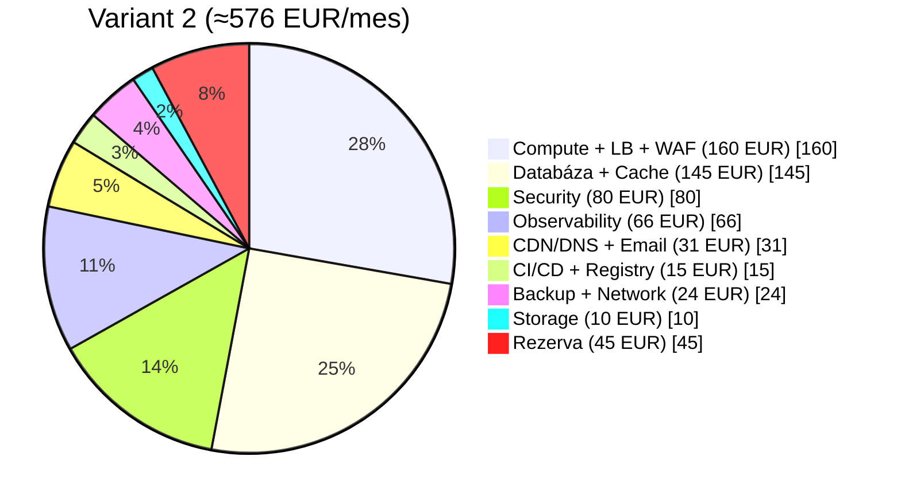

# Essencium — Plán modernizácie na multiplatformu
**Dátum:** 14. marca 2026  
**Verzia:** 0.9.4 → Multiplatform  
**Status:** Plán schválený, implementácia nezačatá

---

## Obsah
1. [Súčasný stav platformy](#1-súčasný-stav-platformy)
2. [Cieľový stav](#2-cieľový-stav)
3. [Migračný plán — 8 fáz (A–H)](#3-migračný-plán--8-fáz-ah)
4. [Závislosťová mapa](#4-závislosťová-mapa)
5. [Servery a služby — kompletný zoznam](#5-servery-a-služby--kompletný-zoznam)
6. [Infraštruktúra — Variant 2 (Balanced / Security-first)](#6-infraštruktúra--variant-2-balanced--security-first)
7. [Mesačný rozpočet](#7-mesačný-rozpočet)
8. [Bezpečnostné funkcie na implementáciu](#8-bezpečnostné-funkcie-na-implementáciu)
9. [Kľúčové súbory pre migráciu](#9-kľúčové-súbory-pre-migráciu)
10. [Teamové a časové nároky](#10-teamové-a-časové-nároky)
11. [Verifikačný checklist](#11-verifikačný-checklist)

---

## 1. Súčasný stav platformy

| Oblasť | Stav |
|--------|------|
| **Frontend** | PHP front-controller (`index.php`) → 12 šablón stránok |
| **JavaScript** | Vanilla JS, 14 globálnych súborov, žiadny bundler |
| **Databáza** | MariaDB na 2× Wedos.net (md393, md394) |
| **API** | 25+ action-based PHP endpointov (`php/*_api.php`) |
| **Autentifikácia** | Len session-based, bcrypt heslá |
| **Šifrovanie** | libsodium / AES-256-GCM / AES-256-CBC+HMAC |
| **Deployment** | Manuálny upload, priečinkové verzionovanie (`/v0.9.4/`) |
| **Webserver** | Apache + mod_expires + .htaccess |
| **CI/CD** | ❌ Žiadne |
| **Kontejnerizácia** | ❌ Žiadna |

### Kritické bezpečnostné medzery (P0)
- Hardcoded credentials v `secrets.php`
- Šifrovací kľúč v `data/key.key` (na disku)
- Žiadny API auth token — len session (blokuje mobile)
- Žiadny rate limiting mimo loginu
- Žiadna CORS/origin validácia
- Žiadne audit logy
- CSRF tokeny bez časovej expirácie
- Fallback na plaintext (`p0:` prefix pri šifrovaní)

### Kritické bloky pre mobile
- JSON denormalizácia: `products_json`, `education_json`, `kits_json`, `basic_mixed_order_json` ako bloby v tabuľke klientov
- Session-only auth (mobil potrebuje JWT/token)
- Runtime `ALTER TABLE` v request path
- Hardcoded file upload paths
- Žiadne API verzionovanie

---

## 2. Cieľový stav

Jedna **API-first platforma** pre všetkých klientov:

```
┌─────────────────────────────────────────────────────────┐
│                   Essencium Platform                    │
├─────────────┬───────────────┬───────────────────────────┤
│  Web App    │  Mobile Web   │  iOS / Android App        │
│  Next.js    │  Next.js PWA  │  React Native / Expo      │
├─────────────┴───────────────┴───────────────────────────┤
│              BFF Layer (Web BFF / Mobile BFF)           │
├─────────────────────────────────────────────────────────┤
│              Core Backend — NestJS (TypeScript)         │
│   Auth │ Products │ Clients │ Education │ Chat │ ...    │
├──────────────┬──────────────┬───────────────────────────┤
│  PostgreSQL  │    Redis     │  Object Storage (S3)      │
└──────────────┴──────────────┴───────────────────────────┘
```

**Odporúčaný tech stack:**
- **Backend:** NestJS (TypeScript)
- **Web:** Next.js (TypeScript, SSR/SSG)
- **Mobile:** React Native / Expo (iOS + Android)
- **Migračná stratégia:** Strangler pattern — nie big-bang rewrite
- **API kontrakt:** OpenAPI ako single source of truth, verzionované endpointy od dňa 1
- **Auth:** OAuth2 / OIDC + JWT + refresh tokens, session bridge pre legacy

---

## 3. Migračný plán — 8 fáz (A–H)

### Fáza A — Nastavenie programu a cieľová architektúra *(blocker)*
1. Definovať cieľový model: klienty + backend + shared services + data layer
2. Vybrať TypeScript monorepo (NestJS + Next.js + React Native/Expo), PHP v prechodnom režime
3. Zaviesť architektúrne pravidlá: API-first, backward compatibility, feature flags, zero-trust
4. **Výstup:** Architektúrny blueprint, domain map, migration backlog, RACI

### Fáza B — Bezpečnosť a platformové fundamenty *(blocker pre mobile)*
1. Odstrániť hardcoded credentials → secrets manager, rotácia všetkých tokenov/kľúčov
2. Zaviesť identitu: OAuth2/OIDC alebo JWT + refresh token, session bridge pre legacy web
3. API gateway: rate limiting, WAF, CORS policy, central authz, audit logs
4. Security baseline: CSP, HSTS, secure cookies, device/session controls, RBAC
5. **Výstup:** Bezpečný unified login a stabilná API perimeter vrstva

### Fáza C — Data a domain refactoring *(čiastočne paralelné)*
1. Rozsekať JSON bloby (`products_json`, `education_json`, `kits_json`) do normalizovaných väzieb
2. Zaviesť schema migrations (Prisma/Flyway), odstrániť runtime `ALTER TABLE`
3. Zaviesť data contracts a OpenAPI schemas, idempotent write patterns
4. Data quality pipeline: backfill, dual-write, consistency checks, rollback
5. Modelovať multi-platform entity boundaries: User, Client, Product, Procedure, Education, Message
6. **Výstup:** Stabilný dátový model pripravený pre web aj mobile

### Fáza D — Backend modernizácia cez Strangler *(závisí na B+C)*
1. Nové doménové API po moduloch — začať low-coupled: Products, Procedures, Education, Ingredients, Kits
2. Potom medium/high-coupled: Inquiries, Chat, Clients, Users
3. Adapter z legacy PHP endpointov na nový service layer pri každom module
4. Event bus pre cross-platform features (notifikácie, activity feed, async jobs)
5. **Výstup:** Moderné API jadro s minimálnou závislosťou na legacy UI

### Fáza E — Frontend/Web rebuild *(paralelne s D po prvých API)*
1. Nový responzívny web (desktop + mobile web) nad rovnakými API kontraktmi
2. Design system: tokeny, komponenty, accessibility, i18n
3. Migrovať kritické flows: login, dashboard, profil, clients, katalógy → potom admin panely
4. SEO/public stránky cez SSR / hybrid rendering (Next.js)
5. **Výstup:** Moderný web ako primárny klient platformy

### Fáza F — Mobile App Delivery *(závisí na B + min. D)*
1. React Native/Expo app zdieľajúca auth, API klient, analytics, push infra
2. Offline-first pre kľúčové obrazovky: cache, sync strategy, conflict resolution
3. Push notifications (FCM/APNS), deep links, in-app updates, crash reporting
4. **Výstup:** Plne funkčná iOS/Android appka

### Fáza G — Infraštruktúra, spoľahlivosť, operácie *(paralelne s D/E/F)*
1. CI/CD pipelines: lint → test → security scan → build → deploy pre všetky klienty
2. Observability: central logs, tracing, metrics, SLO dashboards, alerting, incident runbooks
3. IaC, environment parity (dev/stage/prod), blue-green/canary deploys
4. Reliability controls: backups, PITR, DR testy, autoscaling, queue retry policies
5. **Výstup:** Produkčne robustná infra pripravená na rast

### Fáza H — Rollout a decommission *(závisí na všetkom)*
1. Feature-flag rollout: internal → beta → všetci používatelia
2. Monitorovať KPI: crash-free sessions, API p95 latency, auth failures, conversion, retention
3. Odstrániť legacy endpointy a nepoužívané PHP UI časti
4. **Výstup:** Jedna platforma, viac klientov, nižší maintenance cost

---

## 4. Závislosťová mapa

```
A ──────► B ──────► C ──────► D ──────────────► H
                               │
                               ├──────► E (po prvých API)
                               │
                               └──────► F (po min. API sete)

G beží kontinuálne: B → → → → → → → → → → → → H
```

---

## 5. Servery a služby — kompletný zoznam

| # | Kategória | Služba / Server | Počet | Účel |
|---|-----------|-----------------|-------|------|
| 1 | **Web tier** | Next.js SSR app servers | 2–3 | Web frontend (desktop + mobile web) |
| 2 | **API tier** | NestJS API servers | 2–3 | Core backend, business logika |
| 3 | **Load balancer** | AWS ALB / Nginx | 1 | Rozdelenie traffic + SSL terminácia |
| 4 | **Databáza** | PostgreSQL (RDS Multi-AZ) | 1 primár + 1 replica | Hlavný dátový sklad |
| 5 | **Cache** | Redis (ElastiCache) | 1–2 | Sessions, rate limiting, cache |
| 6 | **Object storage** | S3 / Cloudflare R2 | 1 bucket | Súbory, profilové fotky, dokumenty |
| 7 | **CDN** | Cloudflare Pro | globálne | Cache statík, WAF, DDoS ochrana |
| 8 | **Email** | AWS SES alebo Mailgun | — | Transakčné emaily |
| 9 | **Push notifikácie** | FCM (Android) + APNS (iOS) | — | Mobile push |
| 10 | **Auth server** | Auth0 / Keycloak / vlastný | 1 | OAuth2/OIDC, JWT vydávanie |
| 11 | **API Gateway** | AWS API Gateway alebo Kong | 1 | Rate limiting, CORS, auth, routing |
| 12 | **Queue / Event bus** | SQS + SNS / RabbitMQ | 1 cluster | Async jobs, notifikácie, retries |
| 13 | **Secrets manager** | AWS Secrets Manager / Vault | 1 | Bezpečné ukladanie secrets + rotácia |
| 14 | **CI/CD** | GitHub Actions | — | Build, test, deploy pipelines |
| 15 | **Container runtime** | ECS Fargate / EKS | 1 cluster | Orchestrácia kontajnerov |
| 16 | **Container registry** | ECR (Elastic Container Registry) | 1 | Docker image storage |
| 17 | **Logy** | CloudWatch Logs / Loki | — | Central logging |
| 18 | **Tracing** | AWS X-Ray / Jaeger | — | Distributed tracing |
| 19 | **Metrics + alerting** | CloudWatch / Grafana + Prometheus | — | SLO dashboards, alerting |
| 20 | **Error tracking** | Sentry | — | Crash reporting (web + mobile) |
| 21 | **SAST/SCA** | Snyk / GitHub Security | — | Dependency + code security scans |
| 22 | **Backup + DR** | AWS Backup + S3 cross-region | — | PITR, disaster recovery |

---

## 6. Infraštruktúra — Variant 2 (Balanced / Security-first)

**Region:** AWS eu-central-1 (Frankfurt) + Cloudflare Pro  
**Filozofia:** Prod HA, managed services, zero-trust perimeter, observability od dňa 1

### Compute a hosting
| Služba | Špecifikácia | Poznámka |
|--------|-------------|---------|
| ECS Fargate | NestJS API: 2 tasky × 1 vCPU / 2 GB | Auto-scales na 6 |
| ECS Fargate | Next.js web: 2 tasky × 0.5 vCPU / 1 GB | Auto-scales na 4 |
| Application Load Balancer | 1 ALB | SSL terminácia, health checks |
| AWS WAF | Web ACL s managed rule groups | OWASP Top 10 ochrana |

### Databáza a storage
| Služba | Špecifikácia | Poznámka |
|--------|-------------|---------|
| RDS PostgreSQL | db.t4g.medium, Multi-AZ, 100 GB gp3 | Automatické backupy 7 dní, PITR |
| ElastiCache Redis | cache.t4g.medium, cluster mode | Sessions, rate limiting |
| S3 Standard | Versioning ON, server-side encryption | Súbory, dokumenty |
| S3 Glacier | Lifecycle → 90 dní | Lacný long-term archív |

### Bezpečnosť a auth
| Služba | Špecifikácia | Poznámka |
|--------|-------------|---------|
| AWS Secrets Manager | Automatická rotácia | Všetky DB/API kľúče |
| AWS KMS | 2 CMK kľúče | Envelope encryption |
| Auth0 | Essential plan (1 000 MAU free, potom $23/mes) | OAuth2/OIDC/JWT |
| AWS GuardDuty | Threat detection | Anomálie, intrusion detection |
| AWS Security Hub | Security posture | CIS + NIST benchmarks |
| CloudTrail | API audit log | Všetky AWS akcie |

### CDN, DNS, email
| Služba | Špecifikácia | Poznámka |
|--------|-------------|---------|
| Cloudflare Pro | $25/mes | WAF, DDoS, CDN, Bot Management |
| Route 53 | DNS + health checks | Hosted zone |
| AWS SES | $0.10 / 1 000 emailov | Transakčné emaily |

### Observability
| Služba | Špecifikácia | Poznámka |
|--------|-------------|---------|
| CloudWatch | Logs + Metrics + Alarms | Centrálne logy |
| AWS X-Ray | Distributed tracing | Latency debugging |
| Sentry Team | $26/mes | Error tracking, web + mobile |

### CI/CD a deployment
| Služba | Špecifikácia | Poznámka |
|--------|-------------|---------|
| GitHub Actions | Team plan alebo Free | Build, test, deploy |
| ECR | Elastic Container Registry | Docker image store |
| AWS Backup | RDS + S3 cross-region | Disaster recovery |

### Mobile extras
| Služba | Špecifikácia | Poznámka |
|--------|-------------|---------|
| Expo EAS | Production plan $99/mes | Build + OTA updates |
| Apple Developer | $99/rok | App Store distribúcia |
| Google Play | $25 jednorazovo | Play Store distribúcia |
| FCM / APNS | Free | Push notifikácie |

### Odhad výkonu a záťaže (orientačne, pre Variant 2)

Predpoklady pre odhad:
- API: 2x Fargate task (1 vCPU, 2 GB), web: 2x task (0.5 vCPU, 1 GB), Redis cache, RDS t4g.medium Multi-AZ.
- Cca 65-75% read traffic, cache hit ratio 55-70%, priemerná veľkosť API odpovede 20-60 KB.
- p95 cieľ: do 350 ms pre bežné endpointy (bez veľkých exportov/reportov).

| Scenár | API throughput (req/s) | Peak req/min | Súbežní online používatelia | Odhad MAU | Poznámka |
|--------|-------------------------|--------------|-----------------------------|-----------|----------|
| **Bežná prevádzka** | 70-120 | 4 200-7 200 | 120-350 | 3 000-7 000 | Stabilná prevádzka bez degradácie |
| **Krátkodobá špička (5-15 min)** | 150-220 | 9 000-13 200 | 350-900 | 5 000-10 000 | Pri p95 zvyčajne 350-700 ms |
| **Autoscale strop (API do 6 taskov)** | 220-380 | 13 200-22 800 | 900-1 800 | 10 000-20 000 | Vyžaduje tuning DB poolu a query indexov |

| Databázová vrstva (RDS t4g.medium) | Odhad |
|-------------------------------------|-------|
| Bezpečný počet aktívnych DB spojení cez pool | 80-120 |
| Trvalo udržateľné write operácie | 20-45 write/s |
| Trvalo udržateľné read operácie (bez cache) | 120-250 read/s |

| CDN vrstva (Cloudflare) | Odhad |
|-------------------------|-------|
| Špičkové požiadavky na statický obsah | 2 000-6 000 req/s |
| Odhad odľahčenia backendu cez CDN/cache | 50-85% statických požiadaviek |

Poznámka: čísla sú plánovacie odhady pre sizing. Pred produkčným rolloutom je potrebný k6/Gatling load test nad reálnymi endpointmi a dátami.

---

## 7. Mesačný rozpočet

### Variant 2 — Balanced / Security-first (EUR/mesiac)

| Kategória | Položka | EUR/mes |
|-----------|---------|---------|
| **Compute** | ECS Fargate (API 2 tasky) | ~80 |
| **Compute** | ECS Fargate (Web 2 tasky) | ~35 |
| **Compute** | Application Load Balancer | ~20 |
| **Compute** | AWS WAF | ~25 |
| **Databáza** | RDS PostgreSQL Multi-AZ t4g.medium | ~90 |
| **Cache** | ElastiCache Redis t4g.medium | ~55 |
| **Storage** | S3 Standard + Glacier (50 GB) | ~5 |
| **Storage** | S3 Transfer + requests | ~5 |
| **Security** | AWS Secrets Manager (10 secrets) | ~5 |
| **Security** | AWS KMS (2 CMK) | ~2 |
| **Security** | Auth0 Essential (do 7 000 MAU) | ~23 |
| **Security** | AWS GuardDuty | ~25 |
| **Security** | AWS Security Hub | ~15 |
| **Security** | CloudTrail | ~10 |
| **CDN/DNS** | Cloudflare Pro | ~25 |
| **CDN/DNS** | Route 53 | ~5 |
| **Email** | AWS SES (10 000 emailov/mes) | ~1 |
| **Observability** | CloudWatch Logs + Metrics | ~30 |
| **Observability** | AWS X-Ray | ~10 |
| **Observability** | Sentry Team | ~26 |
| **CI/CD** | GitHub Actions (nad free limit) | ~10 |
| **CI/CD** | ECR (container registry) | ~5 |
| **Backup / DR** | AWS Backup + cross-region S3 | ~15 |
| **Network** | Data transfer out (~100 GB) | ~9 |
| | **CELKOM / mesiac** | **≈ 576 EUR** |
| | CELKOM / rok | **≈ 6 912 EUR** |

### Stručný finančný diagram (mesačne)



> **Poznámka:** Odhad pre startup fázu (1–2 tasky, nie plné peak load). Pri 5×-m raste traffic počítaj s ~900–1 200 EUR/mes.

### Mobile extras (jednorazové + mesačné)
| Položka | Cena |
|---------|------|
| Expo EAS Production | ~99 USD/mes |
| Apple Developer Program | ~99 USD/rok |
| Google Play Developer | ~25 USD jednorazovo |

### Jednorazové implementačné náklady
| Fáza | Odhad |
|------|-------|
| Fázy A–B (security + arch) | 3 000–5 000 EUR |
| Fázy C–D (data + backend) | 5 000–10 000 EUR |
| Fázy E–F (web + mobile) | 5 000–10 000 EUR |
| Fáza G (infra/ops) | 2 000–3 000 EUR |
| **Celkom jednorazovo** | **15 000–28 000 EUR** |

---

## 8. Bezpečnostné funkcie na implementáciu

Kompletný zoznam bezpečnostných prvkov, ktoré možno implementovať priamo do kódu/infraštruktúry:

| # | Funkcia | Priorita | Fáza |
|---|---------|----------|------|
| 1 | **MFA (TOTP/SMS)** pre admin a klientské účty | P0 | B |
| 2 | **RBAC + granulárny permission model** (role, resource, action) | P0 | B |
| 3 | **Rate limiting** na všetkých endpointoch (per-IP, per-user, per-action) | P0 | B |
| 4 | **Device risk scoring** (new device detection, geo anomaly, trusted devices) | P1 | B |
| 5 | **Automatická rotácia kľúčov** (DB passwords, API keys, encryption keys) | P0 | B |
| 6 | **Immutable audit trail** (kto, čo, kedy, odkiaľ, na čom) | P1 | B |
| 7 | **CSP + HSTS + Permissions-Policy** response headers | P0 | B |
| 8 | **WAF custom rules** (SQL injection, XSS, path traversal, bot blocking) | P1 | B |
| 9 | **Admin IP allowlist** s override cez MFA | P1 | B |
| 10 | **DLP v logoch** — maskovanie PII (mená, emaily, telefóny, health dáta) | P1 | C |
| 11 | **SAST + SCA v CI/CD** (Snyk/GitHub Security — každý PR) | P1 | G |
| 12 | **Disaster recovery runbooks** (DB restore, key compromise, account takeover) | P2 | G |
| 13 | **OpenTelemetry tracing** end-to-end (web → API → DB) | P2 | G |
| 14 | **Security posture dashboard** v admine (headers health, key age, incident log) | P2 | H |
| 15 | **Canary / blue-green releases** s automatickým rollback | P2 | G |
| 16 | **Pravidelný pen-test cyklus** (automatizovaný DAST + manuálny quarterly) | P2 | H |
| 17 | **Incident response playbooks** (autom. isolácia kompromitovaného účtu) | P2 | G |
| 18 | **Secure file upload pipeline** (AV scan, MIME validation, quarantine) | P1 | D |
| 19 | **Refresh token rotation** s revocation list (Redis) | P0 | B |
| 20 | **Session anomaly detection** (concurrent sessions, impossible travel) | P1 | B |

---

## 9. Kľúčové súbory pre migráciu

### Priorita P0 — okamžitý security refactor
| Súbor | Dôvod |
|-------|-------|
| `php/secrets.php` | Hardcoded credentials — okamžitý refactor |
| `data/key.key` | Šifrovací kľúč na disku — presunúť do Secrets Manager |

### Blocker architektonické body
| Súbor | Rola v migrácii |
|-------|----------------|
| `index.php` | Front-controller, kandidát na prvý Strangler gateway bod |
| `php/auth.php` | Session/auth flow, základ pre JWT migration bridge |
| `php/config.php` | Infra a DB config baseline pre env var migráciu |

### Prvé API domény na extrakciu (low-coupled)
| Súbor | Coupling | Poradie |
|-------|----------|---------|
| `php/products_api.php` | Nízky | 1. |
| `php/procedures_api.php` | Nízky | 2. |
| `php/education_api.php` | Nízky | 3. |
| `php/ingredients_api.php` | Nízky | 4. |

### Neskoršia fáza (high-coupled)
| Súbor | Problém |
|-------|---------|
| `php/clients_api.php` | JSON bloby: `products_json`, `education_json`, `kits_json` |
| `php/messages_api.php` | Chat domain, mobile readiness |
| `admin.php` | Veľká legacy UI, postupná dekompozícia |

---

## 10. Teamové a časové nároky

### Minimálny tím
| Rola | Počet | Fázy |
|------|-------|------|
| Tech Lead Architect | 1 | A–H |
| Backend Engineers | 2 | B–D |
| Frontend/Mobile Engineers | 2 | E–F |
| DevOps/SRE | 1 | G–H |
| QA Automation | 1 | D–H |
| Security Consultant | 1 (part-time) | B, pen-test |

### Časový odhad
| Míľnik | Čas |
|--------|-----|
| Produkčný multiplatform baseline | 4–6 mesiacov |
| Plná modernizácia + legacy decommission | 8–12 mesiacov |

### Environments
- `dev` → `staging` → `production`
- Preview apps per každý PR

---

## 11. Verifikačný checklist

- [ ] **Architektúra:** ADR review + threat modeling workshop + data contract review pred implementáciou
- [ ] **Bezpečnosť:** SAST/DAST, dependency scan, pen-test pre auth/token/API gateway
- [ ] **Dáta:** Dry-run backfill na staging, row-count parity, checksums, rollback rehearsal
- [ ] **API:** Contract tests (OpenAPI), backward compatibility tests, load tests (p95/p99)
- [ ] **Klienti:** E2E test flows pre web, mobile web, iOS, Android na rovnakých scenároch
- [ ] **Spoľahlivosť:** Chaos/drill test (DB failover, queue outage, service restart), DR restore test
- [ ] **Release:** Canary cohort monitoring + feature-flag kill-switch test

---

## Objednávacie linky

| Služba | URL |
|--------|-----|
| AWS konzola | https://aws.amazon.com/console/ |
| AWS Pricing Calculator | https://calculator.aws/pricing/2/home |
| Cloudflare Pro | https://www.cloudflare.com/plans/pro/ |
| Auth0 Pricing | https://auth0.com/pricing |
| Sentry Pricing | https://sentry.io/pricing/ |
| Snyk Pricing | https://snyk.io/plans/ |
| GitHub Actions Pricing | https://github.com/features/actions |
| Expo EAS Pricing | https://expo.dev/pricing |
| Apple Developer | https://developer.apple.com/programs/ |
| Google Play Console | https://play.google.com/console/signup |
| AWS SES Pricing | https://aws.amazon.com/ses/pricing/ |
| AWS RDS Pricing | https://aws.amazon.com/rds/postgresql/pricing/ |
| AWS ElastiCache | https://aws.amazon.com/elasticache/pricing/ |
| AWS Fargate Pricing | https://aws.amazon.com/fargate/pricing/ |
| AWS Secrets Manager | https://aws.amazon.com/secrets-manager/pricing/ |
| AWS GuardDuty | https://aws.amazon.com/guardduty/pricing/ |
| AWS WAF Pricing | https://aws.amazon.com/waf/pricing/ |

---

*Dokument vygenerovaný: 14. marca 2026 — Essencium Modernization Planning Session*
